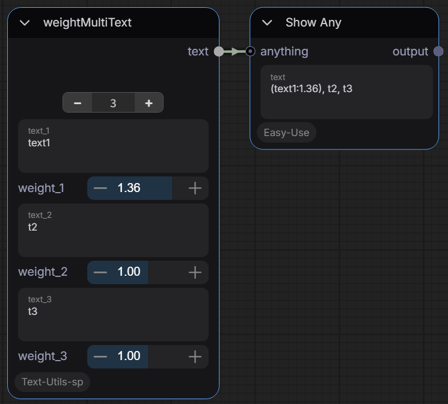
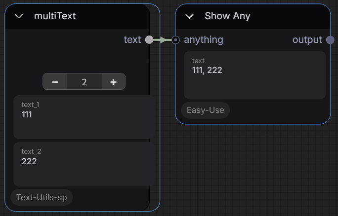
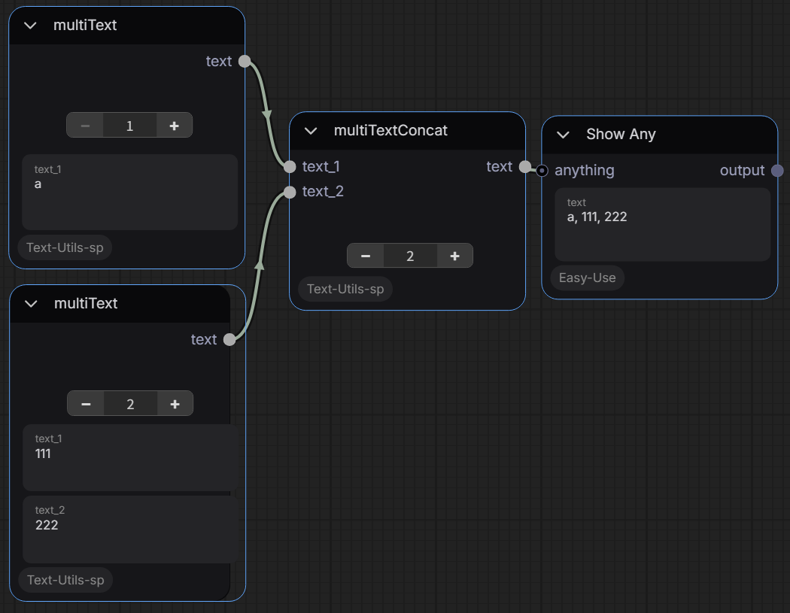
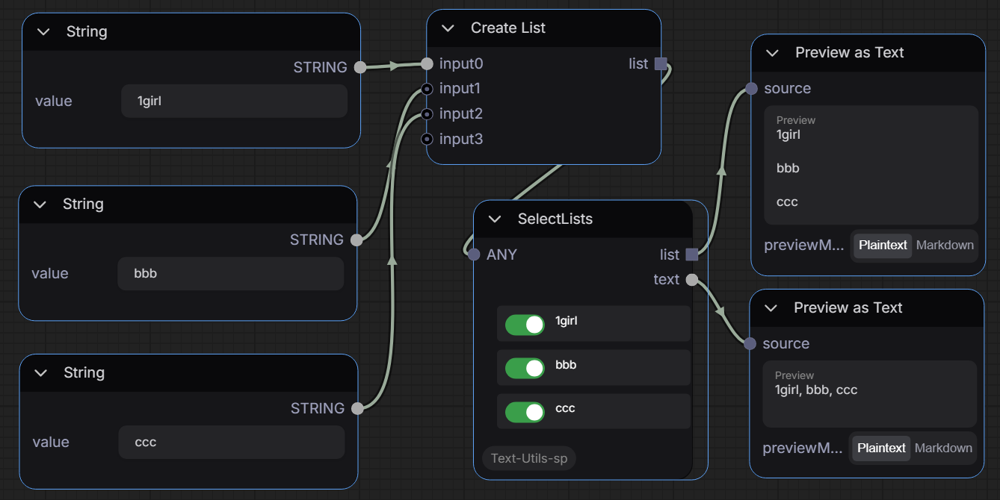

# ComfyUI-Text-Utils-sp

[](#english-version) [](#japanese-version)

ComfyUIのためのカスタムノードコレクションです。堅牢で柔軟なテキスト操作、リスト処理、およびワークフローのタイミング制御に役立つユーティリティを提供します。

---

## <a name="japanese-version"></a>🇯🇵 日本語 (Japanese)
## 既知の問題
Nodes2.0で調整しています。v1でも動作はしますが、一部のウィジェットでサイズがおかしくなります

## ノードと機能

### 1. 動的テキスト結合 (Dynamic Text Combiners)
複数のテキスト入力を増減可能な動的に結合するノード群です。

* **Weight Multi Text (`weightMultiText`)**
  個別のウェイト（重み付け）スライダーを持ち、テキストを動的に結合できます。プロンプトの各要素に特定の強調を行いたい場合に便利です。
  

* **Multi Text (`multiText`)**
  標準的なテキストを結合するための、よりシンプルなバージョンです。テキストエリアを必要に応じて増減させ、カンマ区切りで結合された文字列を出力します。
  

* **Multi Text Concat (`multiTextConcat`)**
  `multiText` と似ていますが、テキストエリアの代わりに **入力コネクタ（スロット）** を動的に提供します。他のテキストノードやプロンプトノードからの出力を1つの文字列にマージするのに最適です。
  

---

### 2. リスト＆選択ユーティリティ (List & Selection Utilities)
インタラクティブなUIを使用して、リスト内のアイテムを動的に処理、フィルタリング、抽出するために設計されたノードです。
入力はANYになっていますが、テキスト系以外

* **Select Texts (`SelectTexts`)**
  カンマ区切りの文字列またはリストを受け取り、（`(word:1.5)` などの入れ子になった強調構文を含めて）解析し、特定のリストのON/OFFを簡単に切り替えることができます。ノードは、アクティブ（ON）になっているアイテムのみを結合した文字列として出力します。


* **Select Lists (`SelectLists`)**
  `SelectTexts` と似ていますが、フラットなカンマ区切りの文字列（`text`）ごとに切り替えを行えます。
  

* **Get Name For LoRA Stack (`GetNameForLoraStack`)**
  標準の ComfyUI LoRA Stack 出力を受け取り、現在アクティブになっている LoRA の名前のみをバッチリスト形式で抽出するユーティリティノードです。

---

### 3. ワークフロータイミング (Workflow Timing)
* **Simple Timer (`SimpleTimer_sp_text`)**
  実行時間を計測するためのユーティリティノードです。経過時間を出力します。最近のアップデートにより、長時間のキュー処理を追跡するためにバッチ全体の合計経過時間も出力できるようになりました。

## インストール方法

1. ComfyUI の `custom_nodes` フォルダに移動します。
2. このリポジトリをクローンします：
   ```bash
   git clone https://github.com/sp8999/ComfyUI-Text-Utils-sp.git
   ```
3. ComfyUI を再起動します。ノードは `text_utils_sp` カテゴリから利用可能になります。

---

## <a name="english-version"></a>🇬🇧 English

## Features & Nodes

### 1. Dynamic Text Combiners
Nodes to combine multiple text inputs dynamically. These nodes feature special UI behaviors allowing you to easily add ("+") or remove ("-") inputs on the fly to match your workflow needs without cluttering the canvas.

* **Weight Multi Text (`weightMultiText`)**
  Allows dynamic combination of texts with individual weight sliders. Useful for prompt mixing where each component needs specific emphasis.

* **Multi Text (`multiText`)**
  A simpler version of the dynamic combiner for standard text strings. Add or remove text areas as needed, and it outputs a comma-separated combined string.

* **Multi Text Concat (`multiTextConcat`)**
  Similar to `multiText`, but instead of text areas, it dynamically provides **input connectors** (slots). Ideal for merging outputs from other text or prompt nodes into a single string.

---

### 2. List & Selection Utilities
Nodes designed to handle, filter, and extract items from lists dynamically using an interactive UI.

* **Select Texts (`SelectTexts`)**
  Accepts a comma-separated string or list, parses it (including nested weights like `(word:1.5)`), and presents each element as an interactive toggle switch on the node itself. You can easily turn specific prompt parts ON/OFF. The node outputs the remaining active items combined as a string.

* **Select Lists (`SelectLists`)**
  Similar to `SelectTexts`, but built for processing lists recursively. It outputs both a flat comma-separated string (`text`) AND the filtered Python list array itself (`list`), preserving data types for downstream batch processing or LoRA stacking.

* **Get Name For LoRA Stack (`GetNameForLoraStack`)**
  A utility node that takes a standard ComfyUI LoRA Stack output and extracts just the names of the active LoRAs in a batched list format. Useful for displaying which LoRAs are currently active in the workflow.

---

### 3. Workflow Timing
* **Simple Timer (`SimpleTimer_sp_text`)**
  A utility node to measure execution time. It outputs the elapsed time. Recent updates allow it to output the total elapsed time for a batch to track long-running queue processing.

## Installation

1. Navigate to your ComfyUI `custom_nodes` folder.
2. Clone this repository:
   ```bash
   git clone https://github.com/sp8999/ComfyUI-Text-Utils-sp.git
   ```
3. Restart ComfyUI. The nodes will be available under the `text_utils_sp` category.
