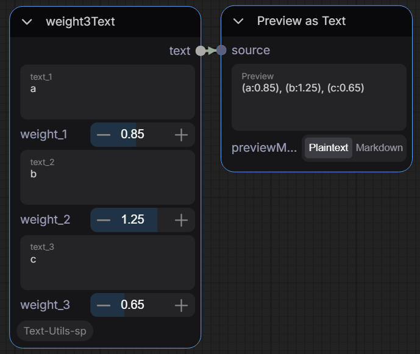
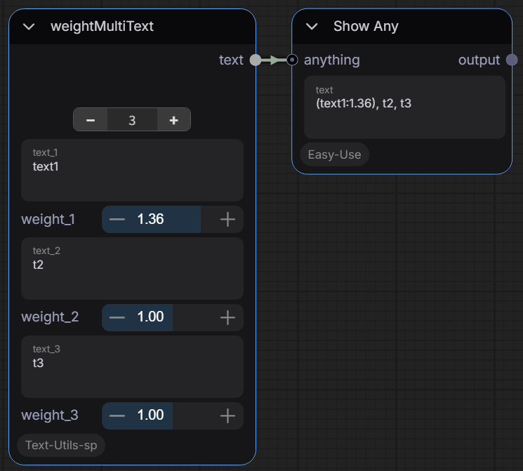
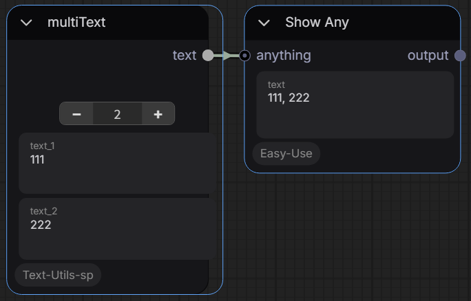
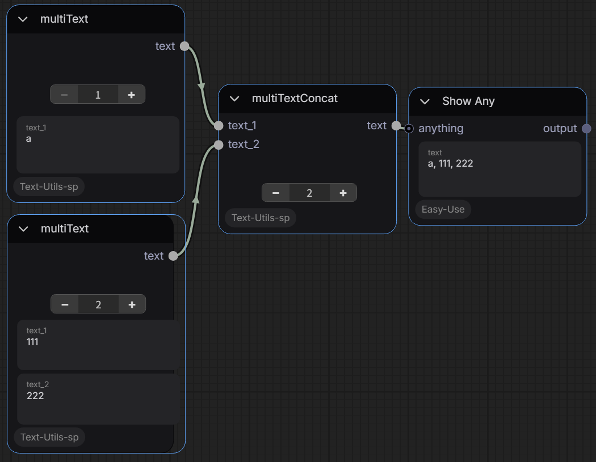
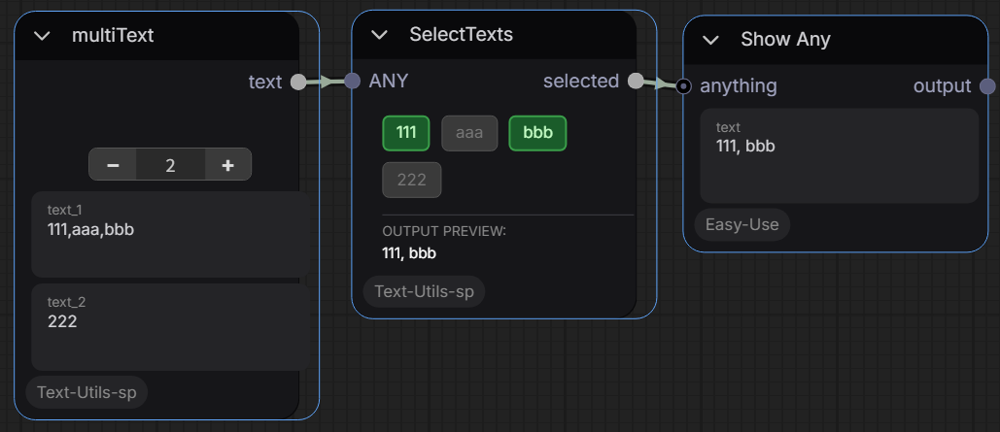
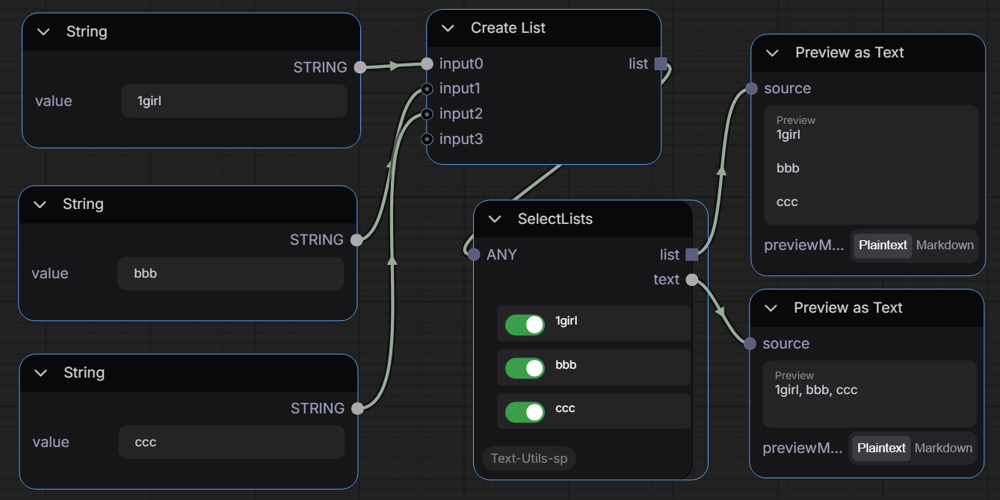
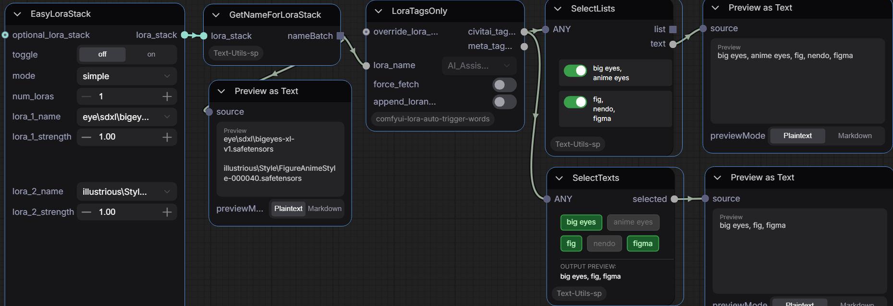
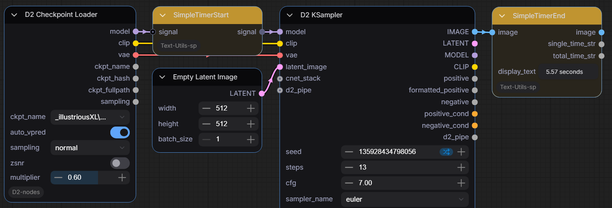

# ComfyUI-Text-Utils-sp

[](#english-version) [](#japanese-version)

LoraTagsOnlyと連携しての自動タグ入力、ただのテキスト操作としても使える、リストのフラット化、リストを選択出力、カンマ区切りテキストの個別トグルボタンでの選択出力など。

---

## <a name="japanese-version"></a>🇯🇵 日本語 (Japanese)

## インストール方法

### ComfyUI Managerからインストール
1. ComfyUI Managerを開きます。
2. "ComfyUI-Text-Utils-sp"を検索します。
3. "Install"ボタンをクリックします。

### 手動インストール
1. ComfyUI の `custom_nodes` フォルダに移動します。
2. powerShellかターミナルを開き以下のコマンドでリポジトリをクローンします。
   ```bash
   git clone https://github.com/sp8999/ComfyUI-Text-Utils-sp.git
   ```
3. ComfyUI を再起動します。ノードは `text_utils_sp` カテゴリから利用可能になります。

<br>

## 既知の問題
Nodes2.0で調整しています。v1でも動作はしますが、一部のウィジェットでサイズがおかしくなります
<br><br>

## ノードと機能

### 1. 動的テキスト結合 (Dynamic Text Combiners)
複数のテキスト入力を色々な方法で結合するノード群です。

* **Weight3Text**
  個別のウェイト（重み付け）スライダーを持ち、テキストを結合して出力します。
  プロンプトの各要素に特定の強調を行いたい場合に便利です。
  <br><br><br>

* **WeightMultiText**
  マルチ接続が可能になるタイプです。
  2スロット目以降はinputにすることはできません。
  <br><br><br>

* **MultiText**
  Weightが無いマルチ接続が可能になるタイプです。
  2スロット目以降はinputにすることはできません。
  <br><br><br>

* **MultiTextConcat**
  **入力コネクタ（スロット）** を動的に提供します。
  他のテキストノードやプロンプトノードからの出力を1つの文字列に結合します。
  <br><br><br>

<br><br>

### 2. リスト＆選択ユーティリティ (List & Selection Utilities)
インタラクティブなUIを使用して、リスト内のアイテムを動的に処理、フィルタリング、抽出するために設計されたノードです。
入力はANYになっていますが、TextとListが対象で画像入力は受け付けられません。

* **SelectTexts**
  カンマ区切りの文字列またはリストを受け取り、（`(word:1.5)` などの入れ子になった強調構文を含めて）解析し、特定のテキストのON/OFFを簡単に切り替えることができます。ノードは、アクティブ（ON）になっているアイテムのみを結合した文字列として出力します。単純なリストフラット化としても使えます。
  <br><br><br>


* **SelectLists**
  `SelectTexts` と似ていますが、こちらは入力されたリスト単位で切り替えを行います。
  単純なリストフラット化としても使えます。
  <br><br><br>

* **GetNameForLoraStack**
  LoRA Stackの出力から、LoRAの名前のみをバッチリスト形式で抽出します。
  [ComfyUI-Lora-Auto-Trigger-WordsのLoraTagsOnly](https://github.com/idrirap/ComfyUI-Lora-Auto-Trigger-Words)と組み合わせて使うことを想定しています。（これがやりたくて他のノードも作ったまである）
  自動で引っ張ってきたタグを必要なものだけONにして出力して使います。
  <br><br><br>

<br><br>

### 3. 出力時間計測

* **SimpleTimer**
  実行時間を計測するためのユーティリティノードです。経過時間を出力します。
  バッチ全体の合計時間と1回の時間を出力します。ウィジェットに表示されるのは1回分のみです。
  Startの置く位置について。
  どこにも繋がずに置いておく場合：最初からEndまでの時間。
  Startをノードに挟んで使う場合：挟んだ位置からEndまでの時間。
<br><br><br>


---

## <a name="english-version"></a>🇬🇧 English

## Installation

### Install from ComfyUI Manager
1. Open ComfyUI Manager.
2. Search for "ComfyUI-Text-Utils-sp".
3. Click the "Install" button.

### Manual Installation
1. Navigate to the `custom_nodes` folder in your ComfyUI directory.
2. Open PowerShell or a terminal and clone the repository with the following command:
   ```bash
   git clone https://github.com/sp8999/ComfyUI-Text-Utils-sp.git
   ```
3. Restart ComfyUI. The nodes will be available in the `text_utils_sp` category.
<br><br>

## Known Issues
Optimized for Nodes 2.0. While it works with v1, some widgets may exhibit incorrect sizing.
<br><br>

## Nodes and Features

### 1. Dynamic Text Combiners
A collection of nodes for dynamically combining multiple text inputs.

* **Weight3Text**
  Provides individual weight sliders to combine and output text. Useful for focusing on specific elements within a prompt.
  <br><br>

* **WeightMultiText**
  A version that supports multiple connections.
  Slots after the 2nd cannot be converted to inputs.
  <br><br>

* **MultiText**
  A version that supports multiple connections without weights.
  Slots after the 2nd cannot be converted to inputs.
  <br><br>

* **MultiTextConcat**
  Dynamically provides **input connectors (slots)**.
  Combines outputs from other text or prompt nodes into a single string.
  <br><br>

<br><br>

### 2. List & Selection Utilities
Nodes designed to dynamically process, filter, and extract items from lists using an interactive UI.
The input is set to ANY, but it is intended for Text and Lists; image inputs are not supported.

* **SelectTexts**
  Accepts a comma-separated string or list, parses it (including nested emphasis syntax like `(word:1.5)`), and allows for easy toggling of specific items ON/OFF. The node outputs only the active (ON) items as a combined string.
  It can also be used as a simple list flattener.
  <br><br>

* **SelectLists**
  Similar to `SelectTexts`, but handles toggling at the list item level.
  It can also be used as a simple list flattener.
  <br><br>

* **GetNameForLoraStack**
  Extracts only the LoRA names from a LoRA Stack output in batch list format.
  Designed for use with [LoraTagsOnly](https://github.com/idrirap/ComfyUI-Lora-Auto-Trigger-Words). (This node set was primarily created to achieve this functionality).
  Toggle only the necessary tags from the automatically retrieved list for output.
  <br><br>

<br><br>

### 3. Output Time Measurement

* **SimpleTimer**
  A utility node to measure execution time. Outputs the elapsed duration.
  Outputs both the total batch time and the time for a single execution. Only the single execution time is shown in the widget.
  Placement of the Start node:
  - Not connected: Measures from the start of the workflow to the End node.
  - Inserted between nodes: Measures from that specific position to the End node.
<br><br>
